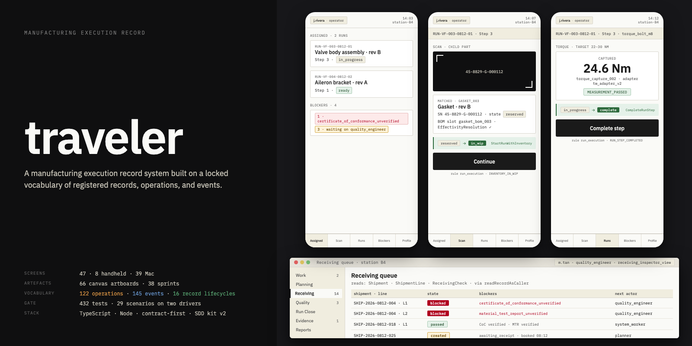

# Distributed Factory Execution & Record System

A factory-execution system for building complex hardware. TypeScript on Node. The specifications were reverse-engineered from public sources — industry standards, published architectures, job postings, open-source projects, regulatory guidance — using Signal-Driven Development and a language model.

Signal-Driven Development: [`docs/SDD_GENERAL_PROCESS.md`](docs/SDD_GENERAL_PROCESS.md). Source list and evaluation: [`specs/founding-stack/01-research-dossier-v0.12.md`](specs/founding-stack/01-research-dossier-v0.12.md) §9-10.

## What it is

A prototype in TypeScript that models a manufacturing execution record system. The runtime reads a single fixed contract; each operation it runs, each event it emits, each record it holds is declared there. The same code runs against a memory backend and a SQLite backend. Twenty-nine scenarios drive each; the two produce event streams that match byte for byte.

## What it is not

- No live floor UI. The design pack under [`canvas/`](canvas/) is 47 wireframes on a canvas.
- No device integration. Scanners, printers, and machine adapters are named in the vocabulary but have no driver code (handoff-E, [`dev/BLACKBOARD.md`](dev/BLACKBOARD.md)).
- No standalone Part, Drawing, MaterialSpecification, or InspectionRequirement records. Those wait behind handoff-F.
- No scheduling, no MRP tie-in, no capacity model.
- No authentication. The caller identity is trusted at the driver boundary.
- No ERP integration, no other-vendor MES connection, no customer portal.

## Status, measured 2026-08-25

- 132 operations, 136 events, 43 records, 16 state machines, 33 authorization rules registered
- 129 of 132 operations built; three unbuilt, each with a reason in the code
- Bench 29/29 on both drivers
- Backend gate exit 0 with fifteen durability proofs
- Whole-bench cross-driver check over 37 scenarios: pass
- Vitest 432/432 across 58 files
- Tsc 0 across `src` and `tests`

Three governing documents closed:

- The nine-document founding stack ([`specs/founding-stack/`](specs/founding-stack/))
- Receiving evidence boundary ([`specs/receiving-evidence/`](specs/receiving-evidence/)) — 15 of 15 §27 criteria pass ([`docs/RECEIVING_ACCEPTANCE.md`](docs/RECEIVING_ACCEPTANCE.md))
- Access and visibility boundary ([`specs/access-and-visibility/`](specs/access-and-visibility/)) — 18 of 18 §16 criteria pass or pass-in-part ([`docs/ACCESS_AND_VISIBILITY_ACCEPTANCE.md`](docs/ACCESS_AND_VISIBILITY_ACCEPTANCE.md))

Full state: [`docs/STATE.md`](docs/STATE.md). Roadmap: [`docs/ROADMAP.md`](docs/ROADMAP.md).

## Quickstart

Node ≥ 22. No build step.

```
npm install
npm run validate:contracts
npm run validate:schemas
node src/harness/bench.ts all
node src/harness/run-backend.ts
npx vitest run
npx tsc -p tsconfig.json --noEmit
```

## Repository layout

Code and data (paths are code-loaded; do not rename):

| Path | Contents |
|---|---|
| [`src/`](src/) | Registry loader, world, operation handlers, in-memory + `node:sqlite` drivers, access-decision model, visibility outcomes, scenario compiler, assertion engine, bench, backend gate |
| [`contracts/`](contracts/) | Sixteen registry YAML files + [`CONTRACT_GAPS.md`](contracts/CONTRACT_GAPS.md) |
| [`scenarios/`](scenarios/) | 38 scenarios, 779 steps |
| [`schemas/`](schemas/) | JSON schemas generated from the registries |
| [`tests/`](tests/) | Vitest suites |

Documentation:

| Path | Contents |
|---|---|
| [`docs/`](docs/) | Project state ledgers. [`docs/DOCS.md`](docs/DOCS.md) catalogs every file. |
| [`specs/`](specs/) | Ingested governing specifications: `founding-stack/`, `receiving-evidence/`, `access-and-visibility/` |
| [`dev/BLACKBOARD.md`](dev/BLACKBOARD.md), [`dev/KIT_DIARY.md`](dev/KIT_DIARY.md), [`dev/WORKING_AGREEMENT.md`](dev/WORKING_AGREEMENT.md), [`dev/ADDENDUMS.md`](dev/ADDENDUMS.md) | SDD process state — at project root by kit convention |
| [`dev/sprints/`](dev/sprints/), [`dev/signal-reports/`](dev/signal-reports/) | Per-sprint history, 001-052 |
| [`dev/reviews/`](dev/reviews/), [`dev/persona-reviews/`](dev/persona-reviews/) | 14-persona aerospace stakeholder review kit and this project's own pass |
| [`demo-packs/`](demo-packs/) | Two demo packs, data only |
| [`dev/sdd-kit-2/`](dev/sdd-kit-2/) | Vendored SDD methodology kit, read-only |

`artifacts/traces/` and `node_modules/` are git-ignored.
